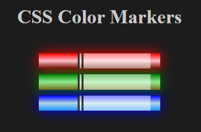

# CSS 3 Color Markers
Small site displaying a set of three colored markers: red, blue, green, using CSS color properties manipulation techniques. Utilizing div tags html/css classes to color and size the markers: CSS properties using margins, paddings, borders, linear-gradients, and box-shadows.

## Future Features
Adding CSS animations to the makers. This will allow for a more interactive experience when hovering over each marker. Including different slection of markers made from a JSON file. Using mouse and drawing controls to draw a picture.

## Site Display

